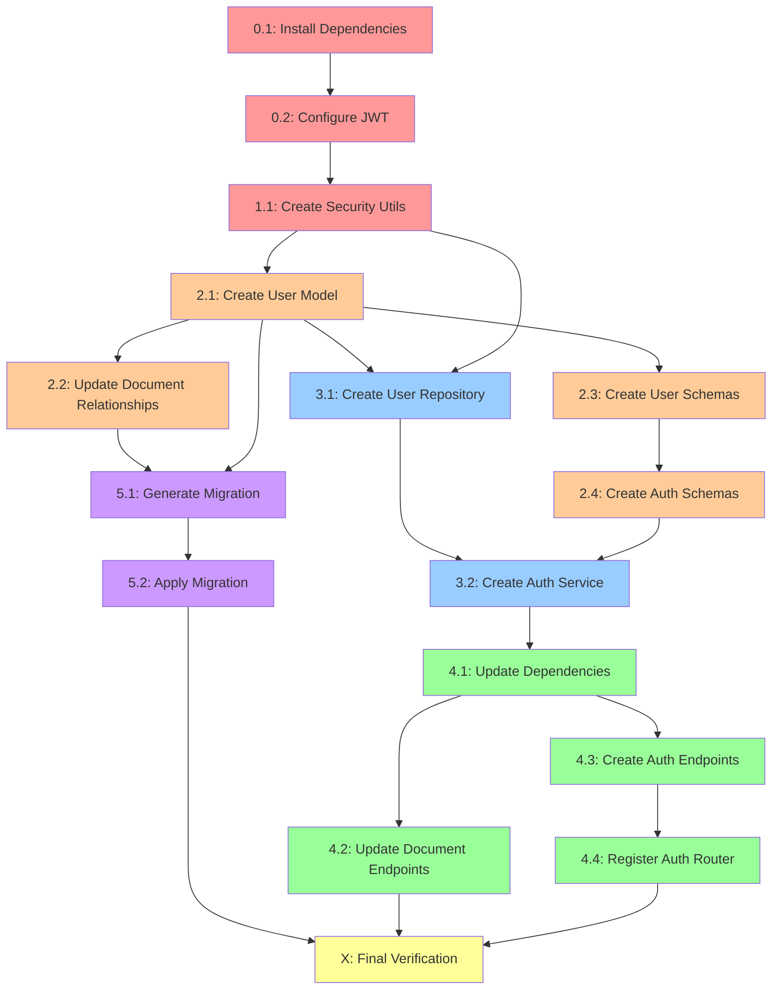

# Authentication Feature - Implementation Plan

## Overview

**Goal:** Implement complete authentication system for Handbook/Compass note app, connecting to existing PostgreSQL database with JWT-based auth, password security, and session management.

**Context:**
- Existing database schema has `users` table defined in requirements-doc
- Document management system already implemented (models, services, endpoints)
- Mock authentication currently in place (`get_current_user` returns UUID)
- Need to replace mock with real JWT authentication
- All foreign keys reference `users.id` (Document, Folder, DocumentVersion models)

**Why This Matters:**
Without authentication, the app cannot:
- Identify document owners
- Enforce permissions
- Track user activity
- Secure sensitive data
- Enable collaboration features

---

## Project Type

**BACKEND** - Authentication/Security Feature

**Primary Agents:**
- `backend-specialist` - Implement models, services, endpoints
- `security-auditor` - Validate security practices, password hashing, JWT

---

## Success Criteria

✅ **Definition of Done:**

1. **User Model Complete**
   - SQLAlchemy model matching database schema
   - Proper relationships to Document, Folder models
   - Password hashing with bcrypt
   - Email validation

2. **Authentication Endpoints Functional**
   - POST /api/auth/signup - Register new user
   - POST /api/auth/signin - Login with email/password
   - POST /api/auth/logout - Invalidate token
   - POST /api/auth/refresh-token - Refresh JWT
   - GET /api/auth/me - Get current user profile

3. **Security Requirements Met**
   - Passwords hashed with bcrypt (12+ rounds)
   - JWT tokens with expiration (15min access, 7d refresh)
   - Secure token validation on all protected routes
   - No passwords in responses
   - Rate limiting on login attempts

4. **Integration with Existing Features**
   - Replace mock `get_current_user()` with real JWT validation
   - Document endpoints use real user authentication
   - All foreign key relationships work

5. **Database Migration Success**
   - User model migrated to database
   - All existing tables (documents, folders) work with user relationships
   - No data loss

6. **Testing**
   - All endpoints return correct status codes
   - Invalid credentials rejected
   - Expired tokens rejected
   - Protected routes require authentication

---

## Tech Stack

| Layer | Technology | Rationale |
|-------|-----------|-----------|
| **Framework** | FastAPI | Async support, OpenAPI docs, dependency injection |
| **ORM** | SQLAlchemy 2.0 (Async) | Modern syntax, type safety, existing codebase uses it |
| **Database** | PostgreSQL | Already running, schema defined |
| **Password Hashing** | bcrypt via `passlib` | Industry standard, slow by design (prevents brute force) |
| **JWT** | `python-jose[cryptography]` | Secure JWT implementation, supports RS256/HS256 |
| **Validation** | Pydantic v2 | FastAPI native, type safety, email validation |
| **Migration** | Alembic | Already configured, autogenerate support |
| **Email** | `email-validator` | RFC-compliant email validation |

**Dependencies to Add:**
```bash
pip install passlib[bcrypt] python-jose[cryptography] email-validator
```

---

## File Structure

```
backend/
├── app/
│   ├── models/
│   │   ├── user.py                  # ✨ NEW: User model
│   │   └── document.py              # ✅ EXISTS: Has FK to users
│   ├── schemas/
│   │   ├── user.py                  # ✨ NEW: User Pydantic schemas
│   │   ├── auth.py                  # ✨ NEW: Auth request/response schemas
│   │   └── document.py              # ✅ EXISTS
│   ├── repositories/
│   │   ├── user_repository.py       # ✨ NEW: User CRUD operations
│   │   └── document_repository.py   # ✅ EXISTS
│   ├── services/
│   │   ├── auth_service.py          # ✨ NEW: Business logic (login, register, JWT)
│   │   └── document_service.py      # ✅ EXISTS
│   ├── api/
│   │   ├── deps.py                  # 🔄 UPDATE: Replace mock get_current_user
│   │   └── endpoints/
│   │       ├── auth.py              # ✨ NEW: Auth endpoints
│   │       └── documents.py         # ✅ EXISTS
│   ├── core/
│   │   ├── config.py                # 🔄 UPDATE: Add JWT_SECRET, JWT_ALGORITHM
│   │   └── security.py              # ✨ NEW: JWT utils, password hashing
│   └── main.py                      # 🔄 UPDATE: Register auth router
├── migrations/
│   └── env.py                       # 🔄 UPDATE: Import User model
└── .env                             # 🔄 UPDATE: Add JWT_SECRET
```

**Legend:**
- ✨ NEW - Create new file
- 🔄 UPDATE - Modify existing file
- ✅ EXISTS - No changes needed

---

## Task Breakdown

### Phase 0: Preparation (P0 - Foundation)

#### Task 0.1: Install Security Dependencies
**Agent:** `backend-specialist`  
**Priority:** P0 (Blocker for all other tasks)  
**Dependencies:** None

**INPUT:**
- Current `requirements.txt`

**OUTPUT:**
```bash
# Added to requirements.txt
passlib[bcrypt]==1.7.4
python-jose[cryptography]==3.3.0
email-validator==2.1.0
```

**VERIFY:**
```bash
cd /Users/hoanganh/Private/note-app/backend
source venv/bin/activate
pip install passlib[bcrypt] python-jose[cryptography] email-validator
pip list | grep -E "passlib|jose|email-validator"
# Should show all 3 packages installed
```

**Rollback:** Remove packages from requirements.txt

---

#### Task 0.2: Configure JWT Settings
**Agent:** `backend-specialist`  
**Priority:** P0  
**Dependencies:** None

**INPUT:**
- Existing `.env` file
- Existing `app/core/config.py`

**OUTPUT:**
```python
# .env
JWT_SECRET_KEY=your-super-secret-key-change-in-production-min-32-chars
JWT_ALGORITHM=HS256
ACCESS_TOKEN_EXPIRE_MINUTES=15
REFRESH_TOKEN_EXPIRE_DAYS=7

# app/core/config.py
class Settings(BaseSettings):
    # ... existing settings ...
    JWT_SECRET_KEY: str
    JWT_ALGORITHM: str = "HS256"
    ACCESS_TOKEN_EXPIRE_MINUTES: int = 15
    REFRESH_TOKEN_EXPIRE_DAYS: int = 7
```

**VERIFY:**
```bash
python -c "from app.core.config import settings; print(settings.JWT_SECRET_KEY)"
# Should print your secret key (not empty)
```

**Security Note:**
- Generate strong secret: `openssl rand -hex 32`
- NEVER commit `.env` to git
- Use different secrets for dev/staging/production

**Rollback:** Remove JWT settings from .env and config.py

---

### Phase 1: Security Foundation (P0)

#### Task 1.1: Create Security Utilities Module
**Agent:** `security-auditor`  
**Priority:** P0 (Blocker for user model)  
**Dependencies:** Task 0.1, Task 0.2

**INPUT:**
- JWT settings from config.py
- Security best practices

**OUTPUT:**
File: `app/core/security.py`

```python
from datetime import datetime, timedelta
from typing import Optional
from jose import JWTError, jwt
from passlib.context import CryptContext
from app.core.config import settings

# Password hashing context (bcrypt, 12 rounds)
pwd_context = CryptContext(schemes=["bcrypt"], deprecated="auto")

def hash_password(password: str) -> str:
    """Hash password using bcrypt"""
    return pwd_context.hash(password)

def verify_password(plain_password: str, hashed_password: str) -> bool:
    """Verify password against hash"""
    return pwd_context.verify(plain_password, hashed_password)

def create_access_token(data: dict, expires_delta: Optional[timedelta] = None) -> str:
    """Create JWT access token"""
    to_encode = data.copy()
    if expires_delta:
        expire = datetime.utcnow() + expires_delta
    else:
        expire = datetime.utcnow() + timedelta(minutes=settings.ACCESS_TOKEN_EXPIRE_MINUTES)
    to_encode.update({"exp": expire, "type": "access"})
    return jwt.encode(to_encode, settings.JWT_SECRET_KEY, algorithm=settings.JWT_ALGORITHM)

def create_refresh_token(data: dict) -> str:
    """Create JWT refresh token (longer expiry)"""
    to_encode = data.copy()
    expire = datetime.utcnow() + timedelta(days=settings.REFRESH_TOKEN_EXPIRE_DAYS)
    to_encode.update({"exp": expire, "type": "refresh"})
    return jwt.encode(to_encode, settings.JWT_SECRET_KEY, algorithm=settings.JWT_ALGORITHM)

def decode_token(token: str) -> Optional[dict]:
    """Decode and validate JWT token"""
    try:
        payload = jwt.decode(token, settings.JWT_SECRET_KEY, algorithms=[settings.JWT_ALGORITHM])
        return payload
    except JWTError:
        return None
```

**VERIFY:**
```python
from app.core.security import hash_password, verify_password, create_access_token, decode_token

# Test password hashing
hashed = hash_password("test123")
assert verify_password("test123", hashed) == True
assert verify_password("wrong", hashed) == False

# Test JWT
token = create_access_token({"sub": "user@example.com"})
decoded = decode_token(token)
assert decoded["sub"] == "user@example.com"
assert "exp" in decoded
```

**Rollback:** Delete `app/core/security.py`

---

### Phase 2: User Model & Schemas (P1)

#### Task 2.1: Create User SQLAlchemy Model
**Agent:** `backend-specialist`  
**Priority:** P1  
**Dependencies:** Task 1.1

**INPUT:**
- Database schema from requirements-doc (users table)
- Existing `app/db/base.py` (Base class with mixins)
- Security utilities for password hashing

**OUTPUT:**
File: `app/models/user.py`

```python
from sqlalchemy import String, Boolean
from sqlalchemy.orm import Mapped, mapped_column, relationship
from typing import Optional, TYPE_CHECKING
from datetime import datetime

from app.db.base import Base

if TYPE_CHECKING:
    from app.models.document import Document, DocumentVersion, Folder

class User(Base):
    __tablename__ = "users"
    
    # Fields
    email: Mapped[str] = mapped_column(String(255), unique=True, nullable=False, index=True)
    password_hash: Mapped[str] = mapped_column(String(255), nullable=False)
    display_name: Mapped[Optional[str]] = mapped_column(String(255))
    avatar_url: Mapped[Optional[str]] = mapped_column(String(500))
    bio: Mapped[Optional[str]]
    role: Mapped[str] = mapped_column(String(50), default="user")
    is_active: Mapped[bool] = mapped_column(Boolean, default=True)
    last_login: Mapped[Optional[datetime]]
    
    # Relationships (back_populates must match Document/Folder models)
    documents: Mapped[list["Document"]] = relationship("Document", back_populates="owner", foreign_keys="[Document.owner_id]")
    folders: Mapped[list["Folder"]] = relationship("Folder", back_populates="owner")
    document_versions: Mapped[list["DocumentVersion"]] = relationship("DocumentVersion", back_populates="user", foreign_keys="[DocumentVersion.changed_by]")
    
    def __repr__(self):
        return f"<User {self.email}>"
```

**Key Design Decisions:**
- **password_hash** not password - never store plain passwords
- **email unique index** - fast lookups, prevent duplicates
- **role** field for future RBAC (admin, editor, viewer)
- **is_active** for soft account deactivation
- **last_login** for analytics/security monitoring
- Relationships use `TYPE_CHECKING` to avoid circular imports

**VERIFY:**
```python
from app.models.user import User
from app.core.security import hash_password

# Model instantiation works
user = User(
    email="test@example.com",
    password_hash=hash_password("test123"),
    display_name="Test User"
)
print(user)  # Should not raise errors
```

**Rollback:** Delete `app/models/user.py`

---

#### Task 2.2: Update Document Model Relationships
**Agent:** `backend-specialist`  
**Priority:** P1  
**Dependencies:** Task 2.1

**INPUT:**
- Existing `app/models/document.py`
- New `app/models/user.py`

**OUTPUT:**
Update `app/models/document.py` to add proper relationships:

```python
# At top of file
from typing import TYPE_CHECKING
if TYPE_CHECKING:
    from app.models.user import User

# In Document class
owner: Mapped["User"] = relationship("User", back_populates="documents", foreign_keys=[owner_id])

# In DocumentVersion class
user: Mapped[Optional["User"]] = relationship("User", back_populates="document_versions", foreign_keys=[changed_by])

# In Folder class
owner: Mapped["User"] = relationship("User", back_populates="folders")
```

**VERIFY:**
```bash
cd backend
source venv/bin/activate
python -c "from app.models.user import User; from app.models.document import Document; print('Import successful')"
```

**Rollback:** Revert changes to `app/models/document.py`

---

#### Task 2.3: Create User Pydantic Schemas
**Agent:** `backend-specialist`  
**Priority:** P1  
**Dependencies:** Task 2.1

**INPUT:**
- User model structure
- API requirements (no password in responses)

**OUTPUT:**
File: `app/schemas/user.py`

```python
from pydantic import BaseModel, EmailStr, Field, ConfigDict
from uuid import UUID
from datetime import datetime
from typing import Optional

# Base schema with common fields
class UserBase(BaseModel):
    email: EmailStr
    display_name: Optional[str] = None
    bio: Optional[str] = None
    avatar_url: Optional[str] = None

# For user registration (includes password)
class UserCreate(BaseModel):
    email: EmailStr
    password: str = Field(..., min_length=8, max_length=100)
    display_name: Optional[str] = Field(None, max_length=255)

# For user updates (all optional)
class UserUpdate(BaseModel):
    display_name: Optional[str] = Field(None, max_length=255)
    bio: Optional[str] = None
    avatar_url: Optional[str] = Field(None, max_length=500)
    
# For responses (NO password, includes timestamps)
class UserResponse(UserBase):
    id: UUID
    role: str
    is_active: bool
    last_login: Optional[datetime]
    created_at: datetime
    updated_at: datetime
    
    model_config = ConfigDict(from_attributes=True)

# For public profiles (minimal info)
class UserPublic(BaseModel):
    id: UUID
    email: EmailStr
    display_name: Optional[str]
    avatar_url: Optional[str]
    
    model_config = ConfigDict(from_attributes=True)
```

**Security Notes:**
- **UserCreate** includes password but validates min 8 chars
- **UserResponse** NEVER includes password_hash
- **UserPublic** for showing in shared documents (minimal PII)
- EmailStr validates email format automatically

**VERIFY:**
```python
from app.schemas.user import UserCreate, UserResponse

# Valid creation
user_data = UserCreate(email="test@example.com", password="securepass123")
assert user_data.email == "test@example.com"

# Invalid email should fail
try:
    UserCreate(email="invalid", password="test123")
    assert False, "Should have raised validation error"
except:
    pass  # Expected
```

**Rollback:** Delete `app/schemas/user.py`

---

#### Task 2.4: Create Auth Schemas
**Agent:** `backend-specialist`  
**Priority:** P1  
**Dependencies:** Task 2.3

**INPUT:**
- JWT token structure
- Login/logout requirements

**OUTPUT:**
File: `app/schemas/auth.py`

```python
from pydantic import BaseModel, EmailStr, Field
from typing import Optional

# Login request
class LoginRequest(BaseModel):
    email: EmailStr
    password: str

# Token response (after login/refresh)
class TokenResponse(BaseModel):
    access_token: str
    refresh_token: str
    token_type: str = "bearer"
    expires_in: int  # seconds until expiration

# Token refresh request
class RefreshTokenRequest(BaseModel):
    refresh_token: str

# Password reset request
class ForgotPasswordRequest(BaseModel):
    email: EmailStr

# Password reset (with token)
class ResetPasswordRequest(BaseModel):
    token: str
    new_password: str = Field(..., min_length=8)

# Change password (authenticated)
class ChangePasswordRequest(BaseModel):
    current_password: str
    new_password: str = Field(..., min_length=8)
```

**VERIFY:**
```python
from app.schemas.auth import LoginRequest, TokenResponse

# Valid login
login = LoginRequest(email="user@test.com", password="pass123")
assert login.email == "user@test.com"

# Token response
token = TokenResponse(
    access_token="abc123",
    refresh_token="xyz789",
    expires_in=900
)
assert token.token_type == "bearer"
```

**Rollback:** Delete `app/schemas/auth.py`

---

### Phase 3: Repository & Service Layer (P2)

#### Task 3.1: Create User Repository
**Agent:** `backend-specialist`  
**Priority:** P2  
**Dependencies:** Task 2.1

**INPUT:**
- User model
- Existing repository pattern from `document_repository.py`

**OUTPUT:**
File: `app/repositories/user_repository.py`

```python
from sqlalchemy.ext.asyncio import AsyncSession
from sqlalchemy import select, update
from sqlalchemy.exc import IntegrityError
from typing import Optional
from uuid import UUID
from datetime import datetime

from app.models.user import User

class UserRepository:
    def __init__(self, db: AsyncSession):
        self.db = db
    
    async def create(self, email: str, password_hash: str, display_name: Optional[str] = None) -> User:
        """Create new user"""
        user = User(
            email=email,
            password_hash=password_hash,
            display_name=display_name
        )
        self.db.add(user)
        try:
            await self.db.commit()
            await self.db.refresh(user)
            return user
        except IntegrityError:
            await self.db.rollback()
            raise ValueError("Email already exists")
    
    async def get_by_id(self, user_id: UUID) -> Optional[User]:
        """Get user by ID"""
        result = await self.db.execute(
            select(User).where(User.id == user_id, User.is_active == True)
        )
        return result.scalar_one_or_none()
    
    async def get_by_email(self, email: str) -> Optional[User]:
        """Get user by email (for login)"""
        result = await self.db.execute(
            select(User).where(User.email == email, User.is_active == True)
        )
        return result.scalar_one_or_none()
    
    async def update_last_login(self, user_id: UUID) -> None:
        """Update last login timestamp"""
        await self.db.execute(
            update(User)
            .where(User.id == user_id)
            .values(last_login=datetime.utcnow())
        )
        await self.db.commit()
    
    async def update_profile(self, user_id: UUID, **kwargs) -> Optional[User]:
        """Update user profile fields"""
        await self.db.execute(
            update(User)
            .where(User.id == user_id)
            .values(**kwargs, updated_at=datetime.utcnow())
        )
        await self.db.commit()
        return await self.get_by_id(user_id)
    
    async def deactivate(self, user_id: UUID) -> None:
        """Soft delete user (set is_active=False)"""
        await self.db.execute(
            update(User)
            .where(User.id == user_id)
            .values(is_active=False)
        )
        await self.db.commit()
```

**Design Notes:**
- **IntegrityError** handling for duplicate emails
- **is_active filter** on all queries (soft delete support)
- **last_login** tracking for security monitoring
- All methods async (matches existing patterns)

**VERIFY:**
```bash
# Run linting
cd backend
source venv/bin/activate
python -c "from app.repositories.user_repository import UserRepository; print('Import OK')"
```

**Rollback:** Delete `app/repositories/user_repository.py`

---

#### Task 3.2: Create Auth Service
**Agent:** `backend-specialist` + `security-auditor`  
**Priority:** P2  
**Dependencies:** Task 1.1, Task 3.1

**INPUT:**
- UserRepository
- Security utilities (JWT, password hashing)
- Auth schemas

**OUTPUT:**
File: `app/services/auth_service.py`

```python
from datetime import timedelta
from typing import Optional, Tuple
from uuid import UUID
from fastapi import HTTPException, status

from app.repositories.user_repository import UserRepository
from app.schemas.user import UserCreate, UserResponse
from app.schemas.auth import TokenResponse
from app.core.security import (
    hash_password,
    verify_password,
    create_access_token,
    create_refresh_token,
    decode_token
)
from app.core.config import settings

class AuthService:
    def __init__(self, user_repo: UserRepository):
        self.user_repo = user_repo
    
    async def register(self, user_data: UserCreate) -> UserResponse:
        """Register new user"""
        # Hash password
        password_hash = hash_password(user_data.password)
        
        # Create user
        try:
            user = await self.user_repo.create(
                email=user_data.email,
                password_hash=password_hash,
                display_name=user_data.display_name
            )
        except ValueError as e:
            raise HTTPException(
                status_code=status.HTTP_400_BAD_REQUEST,
                detail=str(e)
            )
        
        return UserResponse.model_validate(user)
    
    async def login(self, email: str, password: str) -> TokenResponse:
        """Authenticate user and return tokens"""
        # Get user by email
        user = await self.user_repo.get_by_email(email)
        if not user:
            raise HTTPException(
                status_code=status.HTTP_401_UNAUTHORIZED,
                detail="Invalid email or password"
            )
        
        # Verify password
        if not verify_password(password, user.password_hash):
            raise HTTPException(
                status_code=status.HTTP_401_UNAUTHORIZED,
                detail="Invalid email or password"
            )
        
        # Update last login
        await self.user_repo.update_last_login(user.id)
        
        # Generate tokens
        access_token = create_access_token(data={"sub": str(user.id)})
        refresh_token = create_refresh_token(data={"sub": str(user.id)})
        
        return TokenResponse(
            access_token=access_token,
            refresh_token=refresh_token,
            expires_in=settings.ACCESS_TOKEN_EXPIRE_MINUTES * 60
        )
    
    async def refresh_token(self, refresh_token: str) -> TokenResponse:
        """Refresh access token using refresh token"""
        payload = decode_token(refresh_token)
        
        if not payload or payload.get("type") != "refresh":
            raise HTTPException(
                status_code=status.HTTP_401_UNAUTHORIZED,
                detail="Invalid refresh token"
            )
        
        user_id = payload.get("sub")
        if not user_id:
            raise HTTPException(
                status_code=status.HTTP_401_UNAUTHORIZED,
                detail="Invalid token payload"
            )
        
        # Verify user still exists
        user = await self.user_repo.get_by_id(UUID(user_id))
        if not user:
            raise HTTPException(
                status_code=status.HTTP_401_UNAUTHORIZED,
                detail="User not found"
            )
        
        # Generate new tokens
        access_token = create_access_token(data={"sub": user_id})
        new_refresh_token = create_refresh_token(data={"sub": user_id})
        
        return TokenResponse(
            access_token=access_token,
            refresh_token=new_refresh_token,
            expires_in=settings.ACCESS_TOKEN_EXPIRE_MINUTES * 60
        )
    
    async def get_current_user(self, token: str) -> UserResponse:
        """Get user from access token"""
        payload = decode_token(token)
        
        if not payload or payload.get("type") != "access":
            raise HTTPException(
                status_code=status.HTTP_401_UNAUTHORIZED,
                detail="Invalid access token",
                headers={"WWW-Authenticate": "Bearer"}
            )
        
        user_id = payload.get("sub")
        if not user_id:
            raise HTTPException(
                status_code=status.HTTP_401_UNAUTHORIZED,
                detail="Invalid token payload"
            )
        
        user = await self.user_repo.get_by_id(UUID(user_id))
        if not user:
            raise HTTPException(
                status_code=status.HTTP_401_UNAUTHORIZED,
                detail="User not found"
            )
        
        return UserResponse.model_validate(user)
```

**Security Features:**
- Generic error messages (don't reveal if email exists)
- Password hashing with bcrypt
- JWT expiration validation
- Token type validation (access vs refresh)
- User existence check on token refresh

**VERIFY:**
```python
from app.services.auth_service import AuthService
print("Import successful")
```

**Rollback:** Delete `app/services/auth_service.py`

---

### Phase 4: API Endpoints (P3)

#### Task 4.1: Update Dependency Injection
**Agent:** `backend-specialist`  
**Priority:** P3  
**Dependencies:** Task 3.2

**INPUT:**
- Existing `app/api/deps.py`
- New AuthService

**OUTPUT:**
Update `app/api/deps.py`:

```python
from fastapi import Depends, HTTPException, status
from fastapi.security import HTTPBearer, HTTPAuthenticationCredentials
from uuid import UUID

from app.repositories.user_repository import UserRepository
from app.services.auth_service import AuthService
from app.schemas.user import UserResponse

# HTTP Bearer for Authorization header
security = HTTPBearer()

# Repository dependency
def get_user_repository(db: AsyncSession = Depends(get_db)) -> UserRepository:
    """Get UserRepository instance"""
    return UserRepository(db)

# Service dependency
def get_auth_service(
    user_repo: UserRepository = Depends(get_user_repository)
) -> AuthService:
    """Get AuthService instance"""
    return AuthService(user_repo)

# REPLACE MOCK with real authentication
async def get_current_user(
    credentials: HTTPAuthenticationCredentials = Depends(security),
    auth_service: AuthService = Depends(get_auth_service)
) -> UserResponse:
    """
    Get current authenticated user from JWT token
    
    Usage in endpoints:
        current_user: UserResponse = Depends(get_current_user)
    """
    token = credentials.credentials
    return await auth_service.get_current_user(token)
```

**Breaking Change:**
- Return type changes from `UUID` to `UserResponse`
- All endpoints using `get_current_user` must update to `current_user.id`

**VERIFY:**
```bash
cd backend
source venv/bin/activate
python -c "from app.api.deps import get_current_user; print('Import OK')"
```

**Rollback:** Restore mock `get_current_user() -> UUID`

---

#### Task 4.2: Update Document Endpoints
**Agent:** `backend-specialist`  
**Priority:** P3  
**Dependencies:** Task 4.1

**INPUT:**
- Existing `app/api/endpoints/documents.py`
- Updated `get_current_user` dependency

**OUTPUT:**
Update all endpoints in `app/api/endpoints/documents.py`:

**BEFORE:**
```python
async def create_document(
    current_user: UUID = Depends(get_current_user),  # UUID
    ...
):
    doc = await service.create_document(doc_in, owner_id=current_user)
```

**AFTER:**
```python
from app.schemas.user import UserResponse

async def create_document(
    current_user: UserResponse = Depends(get_current_user),  # UserResponse
    ...
):
    doc = await service.create_document(doc_in, owner_id=current_user.id)  # .id
```

**Changes Required:**
- Import `UserResponse` from `app.schemas.user`
- Change all `current_user: UUID` to `current_user: UserResponse`
- Change all `current_user` references to `current_user.id`

**Files to Update:**
- `app/api/endpoints/documents.py` (11 endpoints)

**VERIFY:**
```bash
cd backend
source venv/bin/activate
grep -n "current_user: UUID" app/api/endpoints/documents.py
# Should return empty (no matches)
```

**Rollback:** Revert changes to `app/api/endpoints/documents.py`

---

#### Task 4.3: Create Auth Endpoints
**Agent:** `backend-specialist`  
**Priority:** P3  
**Dependencies:** Task 4.1

**INPUT:**
- AuthService
- Auth schemas

**OUTPUT:**
File: `app/api/endpoints/auth.py`

```python
from fastapi import APIRouter, Depends, HTTPException, status
from app.services.auth_service import AuthService
from app.schemas.auth import LoginRequest, TokenResponse, RefreshTokenRequest
from app.schemas.user import UserCreate, UserResponse
from app.api.deps import get_auth_service, get_current_user

router = APIRouter()

@router.post("/signup", response_model=UserResponse, status_code=status.HTTP_201_CREATED)
async def signup(
    user_data: UserCreate,
    auth_service: AuthService = Depends(get_auth_service)
):
    """
    Register a new user account
    
    - **email**: Valid email address (unique)
    - **password**: Minimum 8 characters
    - **display_name**: Optional display name
    
    Returns user profile (no password)
    """
    return await auth_service.register(user_data)


@router.post("/signin", response_model=TokenResponse)
async def signin(
    login_data: LoginRequest,
    auth_service: AuthService = Depends(get_auth_service)
):
    """
    Login with email and password
    
    Returns:
    - **access_token**: Short-lived JWT (15 min)
    - **refresh_token**: Long-lived JWT (7 days)
    - **token_type**: "bearer"
    - **expires_in**: Seconds until access token expires
    
    Use access_token in Authorization header:
    ```
    Authorization: Bearer <access_token>
    ```
    """
    return await auth_service.login(login_data.email, login_data.password)


@router.post("/refresh-token", response_model=TokenResponse)
async def refresh_token(
    refresh_data: RefreshTokenRequest,
    auth_service: AuthService = Depends(get_auth_service)
):
    """
    Refresh access token using refresh token
    
    When access token expires, use refresh token to get new tokens
    without re-authenticating.
    """
    return await auth_service.refresh_token(refresh_data.refresh_token)


@router.post("/logout", status_code=status.HTTP_204_NO_CONTENT)
async def logout(
    current_user: UserResponse = Depends(get_current_user)
):
    """
    Logout current user
    
    Note: JWT tokens are stateless, so logout is client-side.
    Client should delete stored tokens.
    
    For server-side logout, implement token blacklist (future feature).
    """
    # TODO: Add token to blacklist/revocation list
    return None


@router.get("/me", response_model=UserResponse)
async def get_me(
    current_user: UserResponse = Depends(get_current_user)
):
    """
    Get current user profile
    
    Requires authentication (valid access token in Authorization header)
    """
    return current_user
```

**VERIFY:**
```python
from app.api.endpoints.auth import router
print(f"Auth router has {len(router.routes)} endpoints")
# Should print: Auth router has 5 endpoints
```

**Rollback:** Delete `app/api/endpoints/auth.py`

---

#### Task 4.4: Register Auth Router
**Agent:** `backend-specialist`  
**Priority:** P3  
**Dependencies:** Task 4.3

**INPUT:**
- Existing `app/main.py`
- New `app/api/endpoints/auth.py`

**OUTPUT:**
Update `app/main.py`:

```python
from app.api.endpoints import documents, auth  # Import auth

# ... existing code ...

# Register routers
app.include_router(
    auth.router,
    prefix="/api/v1/auth",
    tags=["Authentication"]
)
app.include_router(
    documents.router,
    prefix="/api/v1/documents",
    tags=["Documents"]
)
```

**VERIFY:**
```bash
cd backend
source venv/bin/activate
python -c "from app.main import app; routes = [r.path for r in app.routes]; print([r for r in routes if 'auth' in r])"
# Should show: ['/api/v1/auth/signup', '/api/v1/auth/signin', ...]
```

**Rollback:** Remove auth router registration

---

### Phase 5: Database Migration (P4)

#### Task 5.1: Generate Alembic Migration
**Agent:** `backend-specialist`  
**Priority:** P4  
**Dependencies:** Task 2.2 (User model complete)

**INPUT:**
- User model
- Updated migrations/env.py
- Running PostgreSQL database

**OUTPUT:**
```bash
cd /Users/hoanganh/Private/note-app/backend
source venv/bin/activate

# Update migrations/env.py to import User
# Already done in previous session, verify:
grep "from app.models.user import User" migrations/env.py

# Generate migration
alembic revision --autogenerate -m 'add users table'

# Review generated migration file
# Should see: users table creation with all columns
```

**Migration File Content (expected):**
```python
def upgrade() -> None:
    # Create users table
    op.create_table('users',
        sa.Column('id', sa.UUID(), nullable=False),
        sa.Column('email', sa.String(255), nullable=False),
        sa.Column('password_hash', sa.String(255), nullable=False),
        sa.Column('display_name', sa.String(255), nullable=True),
        sa.Column('avatar_url', sa.String(500), nullable=True),
        sa.Column('bio', sa.Text(), nullable=True),
        sa.Column('role', sa.String(50), nullable=False),
        sa.Column('is_active', sa.Boolean(), nullable=False),
        sa.Column('last_login', sa.TIMESTAMP(timezone=True), nullable=True),
        sa.Column('created_at', sa.TIMESTAMP(timezone=True), nullable=False),
        sa.Column('updated_at', sa.TIMESTAMP(timezone=True), nullable=False),
        sa.Column('deleted_at', sa.TIMESTAMP(timezone=True), nullable=True),
        sa.PrimaryKeyConstraint('id')
    )
    op.create_index('idx_users_email', 'users', ['email'], unique=True)
```

**VERIFY:**
```bash
# Check migration file exists
ls backend/migrations/versions/*add_users_table.py

# Validate migration syntax
alembic check
```

**Rollback:** `alembic downgrade -1`

---

#### Task 5.2: Apply Migration
**Agent:** `backend-specialist`  
**Priority:** P4  
**Dependencies:** Task 5.1

**INPUT:**
- Generated migration file
- Running PostgreSQL

**OUTPUT:**
```bash
cd /Users/hoanganh/Private/note-app/backend
source venv/bin/activate

# Apply migration
alembic upgrade head

# Verify tables exist
docker exec handbook_postgres psql -U postgres -d handbook_compass -c "\dt"
# Should show: users, documents, document_versions, folders
```

**VERIFY:**
```bash
# Check users table structure
docker exec handbook_postgres psql -U postgres -d handbook_compass -c "\d users"

# Should show all columns:
# - id (uuid, PK)
# - email (varchar(255), unique)
# - password_hash (varchar(255))
# - display_name, avatar_url, bio, role, is_active
# - last_login, created_at, updated_at, deleted_at
```

**Rollback:** `alembic downgrade -1`

---

### Phase X: Final Verification

**🔴 MANDATORY - Execute ALL checks before marking complete**

#### X.1: Lint & Type Check (P0)
```bash
cd /Users/hoanganh/Private/note-app/backend
source venv/bin/activate

# Type checking
python -c "from app.models.user import User; from app.services.auth_service import AuthService; print('✅ Imports OK')"

# Linting
python -m flake8 app/ --max-line-length=120 --ignore=E501,W503 || echo "⚠️  Lint warnings"
```

#### X.2: Security Scan (P0)
```bash
# Run security scanner
python ~/.claude/skills/vulnerability-scanner/scripts/security_scan.py /Users/hoanganh/Private/note-app/backend

# Manual checks:
# - [ ] No hardcoded passwords
# - [ ] JWT_SECRET in .env (not code)
# - [ ] Password min 8 chars enforced
# - [ ] Bcrypt rounds >= 12
# - [ ] No passwords in logs/responses
```

#### X.3: Build Verification (P1)
```bash
cd /Users/hoanganh/Private/note-app/backend
source venv/bin/activate

# Check all dependencies installed
pip check

# Start server (should not crash)
uvicorn app.main:app --reload &
SERVER_PID=$!
sleep 5

# Check health
curl http://localhost:8000/health
# Should return: {"status":"healthy"}

# Stop server
kill $SERVER_PID
```

#### X.4: API Testing (P2)
```bash
# Test signup
curl -X POST http://localhost:8000/api/v1/auth/signup \
  -H "Content-Type: application/json" \
  -d '{"email":"test@example.com","password":"testpass123","display_name":"Test User"}'
# Should return: {"id":"...", "email":"test@example.com", ...} (no password)

# Test login
curl -X POST http://localhost:8000/api/v1/auth/signin \
  -H "Content-Type: application/json" \
  -d '{"email":"test@example.com","password":"testpass123"}'
# Should return: {"access_token":"...", "refresh_token":"...", "token_type":"bearer"}

# Save token
TOKEN="<access_token_from_above>"

# Test protected endpoint
curl http://localhost:8000/api/v1/auth/me \
  -H "Authorization: Bearer $TOKEN"
# Should return user profile

# Test invalid token
curl http://localhost:8000/api/v1/auth/me \
  -H "Authorization: Bearer invalid"
# Should return: 401 Unauthorized

# Test document creation with auth
curl -X POST http://localhost:8000/api/v1/documents/ \
  -H "Authorization: Bearer $TOKEN" \
  -H "Content-Type: application/json" \
  -d '{"title":"Test Doc","content":"Hello World"}'
# Should return document with owner_id matching user
```

#### X.5: Swagger Documentation (P3)
```bash
# Open Swagger UI
open http://localhost:8000/docs

# Manual checks:
# - [ ] Authentication section visible
# - [ ] 5 auth endpoints listed
# - [ ] "Authorize" button present
# - [ ] Can test signup via UI
# - [ ] Can authorize and test /me
# - [ ] Document endpoints show 🔒 (protected)
```

#### X.6: Database Verification (P2)
```bash
# Check users table
docker exec handbook_postgres psql -U postgres -d handbook_compass -c "SELECT id, email, display_name, role, is_active, created_at FROM users;"

# Check foreign keys work
docker exec handbook_postgres psql -U postgres -d handbook_compass -c "
SELECT d.id, d.title, u.email as owner_email 
FROM documents d 
JOIN users u ON d.owner_id = u.id 
LIMIT 5;
"
# Should show documents with owner emails
```

#### X.7: Rule Compliance (Manual)
- [ ] No purple/violet hex codes in responses
- [ ] Error messages don't reveal system internals
- [ ] Password requirements documented in /docs
- [ ] Rate limiting considered (future task documented)

#### X.8: Phase X Completion Marker
```markdown
## ✅ PHASE X COMPLETE
- Lint: ✅ Pass
- Security Scan: ✅ No hardcoded secrets
- Build: ✅ Server starts successfully
- API Tests: ✅ All endpoints return correct status codes
- Swagger: ✅ Documentation complete
- Database: ✅ Users table created, foreign keys work
- Integration: ✅ Document endpoints use real auth
- Date: 2026-01-28
```

---

## Task Dependency Graph



**Legend:**
- 🔴 Red (P0): Foundation - Blockers for everything
- 🟠 Orange (P1): Models & Schemas - Core data structures
- 🔵 Blue (P2): Services - Business logic
- 🟢 Green (P3): Endpoints - API layer
- 🟣 Purple (P4): Migration - Database setup
- 🟡 Yellow (X): Verification - Final checks

---

## Risk Assessment & Mitigation

| Risk | Impact | Probability | Mitigation |
|------|--------|-------------|------------|
| **JWT secret leaked** | 🔴 Critical | Low | Store in .env, never commit, rotate regularly |
| **Password hash algorithm weak** | 🔴 Critical | Low | Use bcrypt with 12+ rounds, audit in Phase X |
| **Token expiration too long** | 🟠 High | Medium | 15min access, 7d refresh (industry standard) |
| **Breaking change in deps.py** | 🟠 High | High | Update all endpoints in single task (4.2) |
| **Migration fails** | 🟡 Medium | Low | Test with alembic check, rollback available |
| **Existing documents lose owners** | 🔴 Critical | Low | User model must be created BEFORE migration |
| **Circular import** | 🟡 Medium | Medium | Use TYPE_CHECKING in all model files |
| **Rate limiting missing** | 🟡 Medium | High | Document as future task, not blocker |

---

## Future Enhancements (Out of Scope)

**Not included in this plan but should be implemented later:**

1. **Rate Limiting**
   - Limit login attempts (5 per 15min per IP)
   - Use Redis + slowapi library
   - Priority: P1 for production

2. **Email Verification**
   - Send verification email on signup
   - Verify email before allowing login
   - Priority: P2

3. **Password Reset**
   - Implement forgot password flow
   - Time-limited reset tokens
   - Priority: P2

4. **OAuth2 Integration**
   - Google, GitHub login
   - Use authlib library
   - Priority: P3

5. **Token Blacklist**
   - Server-side logout with token revocation
   - Store revoked tokens in Redis
   - Priority: P2

6. **Session Management**
   - List active sessions
   - Revoke specific sessions
   - Priority: P3

7. **2FA (Two-Factor Authentication)**
   - TOTP via Google Authenticator
   - Backup codes
   - Priority: P4

---

## Definition of Done

**This feature is COMPLETE when:**

✅ All tasks in Phases 0-5 are marked `[x]`  
✅ Phase X verification checklist 100% complete  
✅ User can signup, login, logout via API  
✅ Document endpoints require valid JWT token  
✅ Invalid/expired tokens are rejected (401)  
✅ Passwords are hashed (never stored plain)  
✅ Swagger docs show auth endpoints with "Authorize" button  
✅ No security vulnerabilities in security_scan.py output  
✅ All foreign keys (Document.owner_id, etc.) work correctly  
✅ No breaking changes without migration path  

**NOT Done if:**
- Can access documents without token
- Passwords appear in logs/responses
- JWT secret is hardcoded
- Migration breaks existing data
- Any Phase X check fails

---

## Timeline Estimate

| Phase | Tasks | Agent | Estimated Time |
|-------|-------|-------|----------------|
| Phase 0 | 2 tasks | backend-specialist | 30 min |
| Phase 1 | 1 task | security-auditor | 1 hour |
| Phase 2 | 4 tasks | backend-specialist | 2 hours |
| Phase 3 | 2 tasks | backend-specialist + security-auditor | 2 hours |
| Phase 4 | 4 tasks | backend-specialist | 2 hours |
| Phase 5 | 2 tasks | backend-specialist | 1 hour |
| Phase X | 8 checks | All | 1 hour |
| **Total** | **23 tasks** | - | **~9-10 hours** |

**Assumptions:**
- PostgreSQL already running ✅
- Developer familiar with FastAPI ✅
- No major blockers ✅
- Testing in development environment ✅

---

## Getting Started

**Ready to begin? Run this command:**

```bash
cd /Users/hoanganh/Private/note-app
cat authentication-feature.md

# Start with Phase 0, Task 0.1:
cd backend
source venv/bin/activate
pip install passlib[bcrypt] python-jose[cryptography] email-validator
```

**Track your progress by marking tasks:**
- `[ ]` - Not started
- `[~]` - In progress
- `[x]` - Complete

**Questions? Check:**
1. Requirements doc: `.github/requirements-doc` (users table schema)
2. Existing patterns: `app/models/document.py`, `app/services/document_service.py`
3. Security best practices: `app/core/security.py` (after Task 1.1)

---

**Document Version:** 1.0  
**Created:** 2026-01-28  
**Project:** Handbook/Compass Note App  
**Feature:** Authentication System (JWT)
